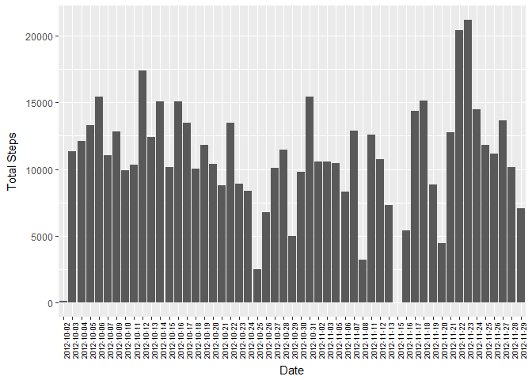
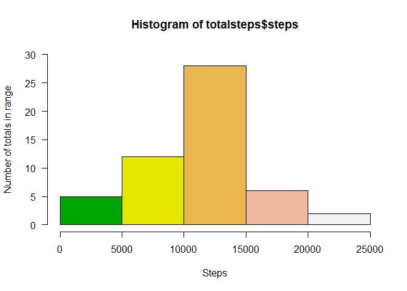
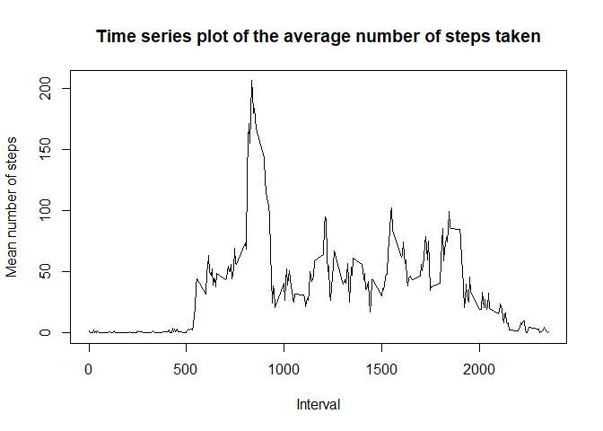
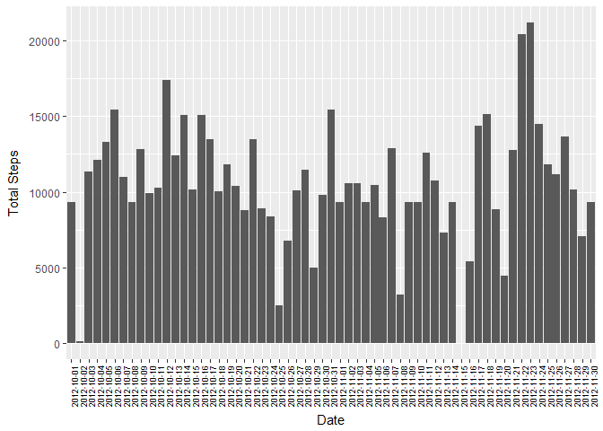
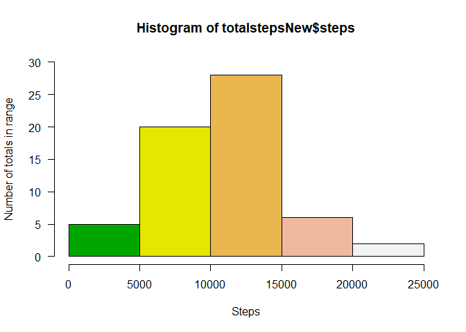
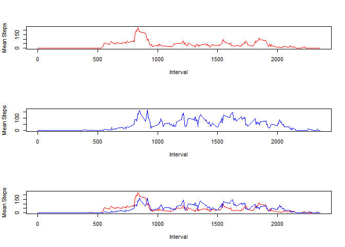

###Part 1: Loading and preprocessing the data
Downloading, extracting and loading the data into variable "data"

```r
library(ggplot2)
library(htmlTable)
```

```
## Warning: package 'htmlTable' was built under R version 3.4.3
```

```r
zipfile <- "activity.zip"
filename <- "activity.csv"

if(!(file.exists(zipfile))){
    zipurl <- "https://d396qusza40orc.cloudfront.net/repdata%2Fdata%2Factivity.zip"
    download.file(url=zipurl,destfile=zipfile)
    unzip(zipfile) 
}

data <- read.csv(filename)
```

###Part 2 Version 1: Histogram of the total number of steps taken each day
Histogram of the total number of steps taken each day doesn't exactly sound like what a histogram does and I believe the plot below does give the picture of the total number of steps that were tracked every day in the dataset.


```r
totalsteps <- aggregate( steps ~ date, data, sum, na.rn = TRUE)

g <- ggplot(totalsteps, aes(x=factor(date), y=steps))

g + geom_bar(stat="identity") + 
    labs(x="Date", y=expression("Total Steps")) + 
    labs(title=expression("")) + 
    theme(axis.text.x=element_text(color = "black", size=7, angle=90, vjust=.8, hjust=0.8))
```

<!-- -->

###Part 2 Version 2: Included below a histogram as well

```r
hist(totalsteps$steps,
     main = "Histogram of total steps per day",
     xlab = "Steps",
     ylab = "Number of totals in range",
     col = terrain.colors(5),
     las = 1,
     ylim = c(0, 30)
)
```

<!-- -->

###Part 3: Mean and median number of steps taken each day

```r
Mean_Steps = round(mean(totalsteps$steps, na.rm = TRUE))
Median_Steps = round(median(totalsteps$steps, na.rm = TRUE))
```
**Mean Steps:** 10767  
**Median Steps:** 10766

###Part 4: Time series plot of the average number of steps taken

```r
steps_by_interval <- aggregate(steps ~ interval, data, mean)
plot(steps_by_interval$interval, steps_by_interval$steps, 
     type = "l", lwd = 1.5, 
     xlab = "Interval", ylab = "Mean number of steps",
     main = "Time series plot of the average number of steps taken")
```

<!-- -->

###Part 5: The 5-minute interval that, on average, contains the maximum number of steps

```r
m_row <- steps_by_interval[steps_by_interval$steps == max(steps_by_interval$steps), ]
#m_row[1,1] will give the interval
```
Interval that gives the max average steps: **835**


###Part 6: Code to describe and show a strategy for imputing missing data
The problem here is to find a way to replace a suitable value for those intervals that has a NA (missing) value. The strategy is to look at the interval itself and find the mean. For example, sum all the steps available for interval 0 (excluding NA) and divide by total number of occurence of interval 0 (call this mean m0). Next is to replace all the occurence of interval 0 with this mean. Note that we do not replace values of intervals with steps = 0 because this is not defined as a missing value. Do this for all intervals.


```r
#create a new data frame. This new data frame will be modified to include the imputed values
dataNew <- data.frame(data)
intervalFactor <- as.factor(dataNew$interval)

#Loop through the intervals available
for (i in levels(intervalFactor)){ 
    datarow <- data[data$interval == i,1]         #Get all the steps for interval i e.g. across the two months
    rowsum <- sum(datarow, na.rm = TRUE)          #sum all the steps for interval i, removing NA values
    replaceValue <- round(rowsum/length(datarow)) #Take the mean, round the value to a whole number
    
    #Loop through the entire new data dataframe.
    #if the interval == current interval being calculated and this interval is not NA Replace with the calculated mean.
    #Note that if the interval has step value = 0, we do nothing because it's not considered missing
    for (j in 1:nrow(dataNew)){
        if (dataNew[j,3] == i && is.na(dataNew[j,1])) {
            dataNew[j,1] <- replaceValue
        }
    }
}
```

###Part 7: Histogram of the total number of steps taken each day after missing values are imputed

```r
totalstepsNew <- aggregate( steps ~ date, dataNew, sum)

g <- ggplot(totalstepsNew, aes(x=factor(date), y=steps))

g + geom_bar(stat="identity") + 
    labs(x="Date", y=expression("Total Steps")) + 
    labs(title=expression("Histogram of total steps per day")) + 
    theme(axis.text.x=element_text(color = "black", size=7, angle=90, vjust=.8, hjust=0.8))
```

<!-- -->

```r
hist(totalstepsNew$steps,
     main = "Histogram of total steps per day",
     xlab = "Steps",
     ylab = "Number of totals in range",
     col = terrain.colors(5),
     las = 1,
     ylim = c(0, 30)
)
```

<!-- -->

```r
Mean_StepsNew = round(mean(totalstepsNew$steps, na.rm = TRUE))
Median_StepsNew = round(median(totalstepsNew$steps, na.rm = TRUE))

meanchange <- round(((Mean_StepsNew - Mean_Steps)/Mean_Steps)*100, digits = 2)
medianchange <- round(((Median_StepsNew - Median_Steps)/Median_Steps)*100, digits = 2)
```


**New Mean Steps:** 10581  
**New Median Steps:** 10395

Steps Type    | Original                       | With Imputed Values                | Percentage Change 
------------- | ----------------               | --------------------               | ----------
Mean Steps    | 10767   | 10581    | -1.73% 
Median Steps  | 10766 | 10395  | -3.45%

**Q:  Do these values differ from the estimates from the first part of the assignment? What is the impact of imputing missing data on the estimates of the total daily number of steps?**

**A: **From the algorithm of imputing the missing values, there did not seem to be a big impact of these missing values. (See the comparison table above)

###Part 8: Panel plot comparing the average number of steps taken per 5-minute interval across weekdays and weekends

```r
dataNew$dayofweek <- as.factor(weekdays(as.Date(dataNew$date))) #new column to indicate which day

dfwd <- data.frame(as.integer(), as.integer(), as.integer(), as.numeric()) #initial
dfwe <- data.frame(as.integer(), as.integer(), as.integer(), as.numeric())
names(dfwd) <- c("interval", "steps", "frequency", "mean")    
names(dfwe) <- c("interval", "steps", "frequency", "mean")

counter <- 1
for (i in levels(intervalFactor)) {
    dfwe[counter, 1] <- i
    dfwe[counter, 2] <- 0
    dfwe[counter, 3] <- 0
    dfwe[counter, 4] <- 0
    dfwd[counter, 1] <- i
    dfwd[counter, 2] <- 0
    dfwd[counter, 3] <- 0
    dfwd[counter, 4] <- 0
    counter <- counter + 1
}

for (i in 1: nrow(dataNew)){
    rowday = tolower(dataNew[i,4])
    if (rowday == "saturday" | rowday == "sunday") {
        dfwe[dfwe$interval == dataNew[i,3], 2] <- dfwe[dfwe$interval == dataNew[i,3], 2] + dataNew[i,1]
        dfwe[dfwe$interval == dataNew[i,3], 3] <- dfwe[dfwe$interval == dataNew[i,3], 3] + 1
    }
    else {
        dfwd[dfwd$interval == dataNew[i,3], 2] <- dfwd[dfwd$interval == dataNew[i,3], 2] + dataNew[i,1]
        dfwd[dfwd$interval == dataNew[i,3], 3] <- dfwd[dfwd$interval == dataNew[i,3], 3] + 1
    }
}

for (i in 1:nrow(dfwd)) {
    dfwd[i,4] <- dfwd[i,2]/dfwd[i,3]
    dfwe[i,4] <- dfwe[i,2]/dfwe[i,3]
}

par(mfrow=c(3,1))

plot(dfwd$interval, dfwd$mean, type="l", col = "red", xlab = "Interval", ylab = "Mean Steps", main = "Weekday Trend")
plot(dfwe$interval, dfwe$mean, type="l", col = "blue", xlab = "Interval", ylab = "Mean Steps", main = "Weekend Trend")

plot(dfwd$interval, dfwd$mean, type="l", col="red", xlab = "Interval", ylab = "Mean Steps", main = "Combined Plot")
points(dfwe$interval, dfwe$mean, type="l", col="blue")
```

<!-- -->

**Q: Are there differences in activity patterns between weekdays and weekends?**    
**A: **There is a third plot that combines the two into the same plot. From this plot, we can see that there is some differences in the activity patters. 1. In weekdays (red), we can see more activity in the mornings and starts earlier while activity levels drop as the day passes. In weekends, there is less activity in the morning but increases as the day passes.
